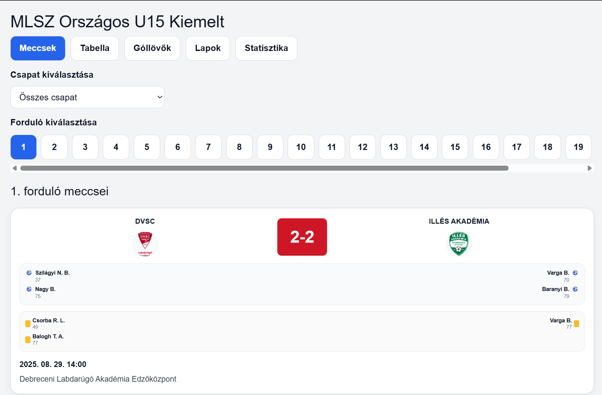
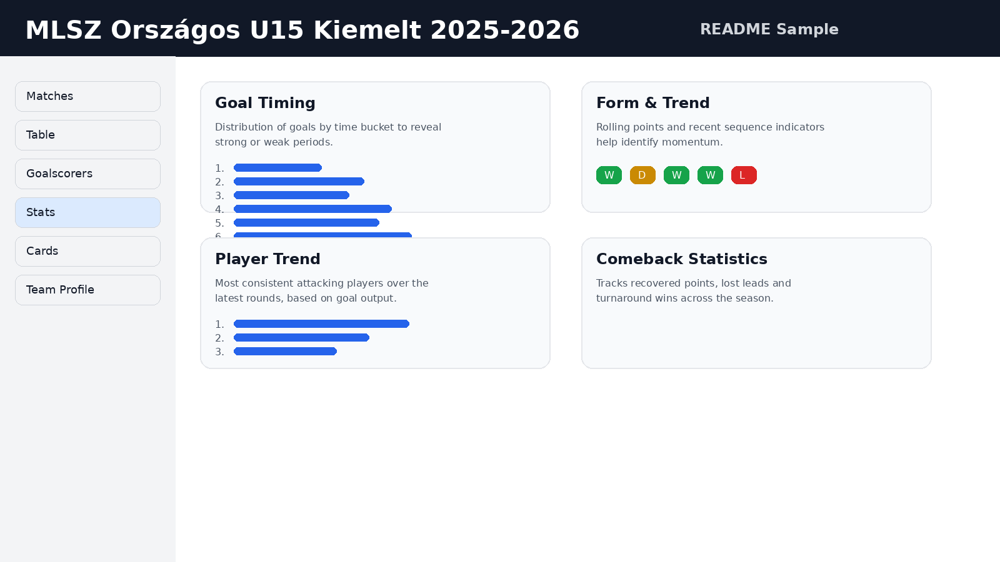
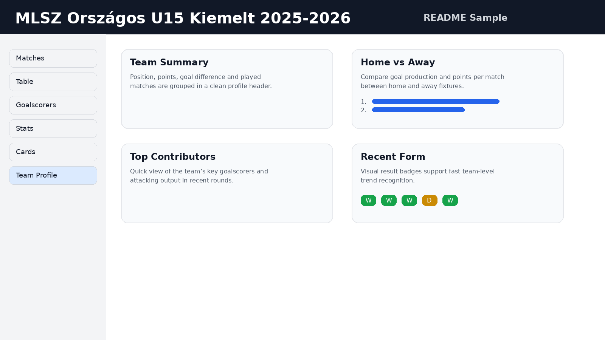

# ⚽ Football Statistics Dashboard


[](https://YOUR-PROJECT.vercel.app)

A modern, responsive football statistics web application built with Next.js.  
The app provides match data, league tables, player statistics, and advanced analytics.

> Replace `https://www.ute2011.hu` with your actual Vercel domain.  
> After that, the **Live Demo** badge and link will work automatically.

---

## 🌐 Live URL

**Production:** https://mlsz-u15-stats.vercel.app/

---

## 📸 Screenshots

### Home / Matches


### Statistics


### Team View


---

## 🚀 Features

### 📊 Core Features
- Match results by round
- League table standings
- Top goalscorers
- Match details (goals, scorers, timing)
- Card statistics (yellow/red)

### 📈 Advanced Statistics
- Goal timing analysis (0–15, 16–30, etc.)
- Team form & performance trends
- Player performance trends
- Comeback statistics (turnarounds, lost leads)
- Team efficiency metrics
- Poisson-based prediction tools

### 👤 Team View
- Team profile summary
- Form tracking
- Season match history
- Mini stats (PPM, goals per match, win rate)

---

## 🛠️ Tech Stack

- **Framework:** Next.js
- **Language:** TypeScript
- **Data:** JSON datasets generated by scraping scripts
- **Deployment:** Vercel
- **Version control:** GitHub

---

## 📂 Project Structure

```text
/app
  page.tsx
/components
  MatchCard.tsx
  TableView.tsx
  GoalscorersView.tsx
  StatsView.tsx
  CardsView.tsx
  TeamProfile.tsx
/data
  matches.json
  tables.json
  goalscorers.json
  match_goalscorers.json
  cards.json
/scripts
  scrape_matches.py
  scrape_tables.py
  scrape_goalscorers.py
  scrape_match_goalscorers.py
  run_all.py
```

---

## 📡 Data Source

Primary source: `adatbank.mlsz.hu`

The project uses custom Python scripts to collect and normalize:
- fixtures and results
- league tables
- goalscorers
- per-match goal events
- disciplinary data

---

## ▶️ Getting Started

```bash
npm install
npm run dev
```

Open in browser:

```text
http://localhost:3000
```

---

## 📱 Responsive Design

The application is designed for:
- desktop
- tablet
- mobile

---

## 🔮 Roadmap

- dark mode
- richer charts
- player profile pages
- stronger match prediction models
- push notifications
- backend/API layer

---

## 📄 License

Educational / personal use.

---

# ⚽ Labdarúgás Statisztikai Dashboard

Modern, reszponzív futball statisztikai webalkalmazás Next.js alapokon.

> Cseréld le a `https://www.ute2011.hu` címet a saját Vercel linkedre,  
> és utána a **Live Demo** badge automatikusan működni fog.

---

## 🌐 Éles URL

**Production:** https://mlsz-u15-stats.vercel.app/

---

## 📸 Képernyőképek

### Kezdőlap / Meccsek


### Statisztikák


### Csapat nézet


---

## 🚀 Funkciók

### 📊 Alap funkciók
- meccseredmények fordulónként
- tabella
- góllövőlista
- meccsrészletek
- sárga/piros lap statisztikák

### 📈 Haladó statisztikák
- gól-időzítés elemzés
- csapat forma és trendek
- játékos trendek
- comeback statisztikák
- hatékonysági mutatók
- Poisson alapú előrejelzések

### 👤 Csapat nézet
- csapatprofil
- forma követés
- szezonmeccsek
- mini statok

---

## 🛠️ Technológia

- **Framework:** Next.js
- **Nyelv:** TypeScript
- **Adatok:** JSON
- **Deploy:** Vercel
- **Verziókezelés:** GitHub

---

## 📂 Projekt struktúra

```text
/app
/components
/data
/scripts
```

---

## 📡 Adatforrás

Elsődleges forrás: `adatbank.mlsz.hu`

A projekt egyedi Python scriptekkel gyűjti és dolgozza fel az adatokat.

---

## ▶️ Indítás

```bash
npm install
npm run dev
```

Megnyitás:

```text
http://localhost:3000
```

---

## 📱 Reszponzivitás

Optimalizálva:
- desktop
- tablet
- mobil

---

## 🔮 További tervek

- dark mode
- több grafikon
- játékos profilok
- jobb predikciók
- push értesítések
- backend/API

---

## 📄 Licenc

Oktatási és személyes célú használatra.
